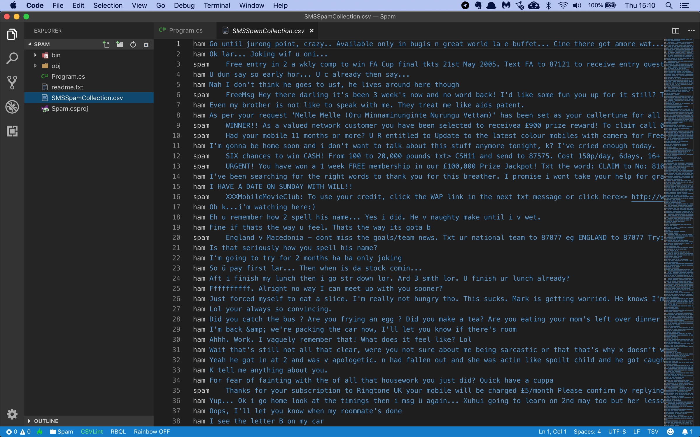

# Assignment: Detect spam SMS messages

In this assignment you're going to build an app that can automatically detect spam SMS messages.

The first thing you'll need is a file with lots of SMS messages, correctly labelled as being spam or not spam. You will use a dataset compiled by Caroline Tagg in her [2009 PhD thesis](http://etheses.bham.ac.uk/253/1/Tagg09PhD.pdf). This dataset has 5574 messages.

Download the [list of messages](https://github.com/mdfarragher/DSC/blob/master/BinaryClassification/SpamDetection/spam.tsv) and save it as **spam.tsv**.

The data file looks like this:



It’s a TSV file with only 2 columns of information:

* Label: ‘spam’ for a spam message and ‘ham’ for a normal message.
* Message: the full text of the SMS message.

You will build a binary classification model that reads in all messages and then makes a prediction for each message if it is spam or ham.


Let's get started by creating a new folder for our application:

```bash
$ mkdir SpamDetection
$ cd SpamDetection
```

If you haven't done so yet, install the NimbusML package:

```bash
$ pip install nimbusml
```

And now launch the Visual Studio Code editor to start building your app:

```bash
$ code Program.py
```

Now you are ready to start coding. You’ll need a couple of import statements:

```python
import pandas as pd
import numpy as np

from sklearn.model_selection import train_test_split
from nimbusml import Pipeline, Role
from nimbusml.feature_extraction.text import NGramFeaturizer
from nimbusml.feature_extraction.text.extractor import Ngram
from nimbusml.linear_model import LogisticRegressionBinaryClassifier

# the rest of the code goes here....
```

We'll use **Pandas** DataFrames to import data from CSV files and process it for training. We'll need **Numpy** too because Pandas depends on it. 

And we'll need the **Pipeline**, **Role**, **NGramFeaturizer** and **LogisticRegressionBinaryClassifier** classes when we start building the machine learning pipeline. We'll do that in a couple of minutes.

Finally, the **train_test_split** function in the **Sklearn** package is very convenient for splitting a single CSV file dataset into a training and testing partition.  

But first, let's load the training data in memory:

```python
# load the file
dataFrame = pd.read_csv("spam.tsv", 
                        sep='\t', 
                        names=["Verdict", "Message"],
                        header=None)

# convert verdict code to a boolean value
dataFrame["Verdict"] = dataFrame["Verdict"].apply(lambda x: 1.0 if x == "spam" else 0.0)

# create train and test partitions
trainData, testData = train_test_split(dataFrame, test_size=0.2, random_state=42, shuffle=True)

# the rest of the code goes here....
```

This code calls **read_csv** from the Pandas package to load the TSV data into a new DataFrame. Note the **names=[...]** argument that explicitly provides the column names. We need to do this because the data file does not contain any column headers.

The next line converts the **Verdict** column in the data file which is a string value of either 'spam' or 'ham', with 'ham' meaning the message is not spam. 

But we are building a binary classifier which means the model needs to be trained on boolean labels. We need to somehow convert these string labels to True and False values.

So what this line does is convert all verdict column values of 'spam' to 1.0, and all column values of 'ham' to 0.0.

Finally, we call **train_test_split** to set up a training partition with 80% of the data and a test partition with the remaining 20% of the data. Note the **shuffle=True** argument which produces randomized partitions. 

Now you’re ready to start building the machine learning model:

```python
# build a machine learning pipeline
pipeline = Pipeline([
    NGramFeaturizer(word_feature_extractor = Ngram(weighting = 'Tf')) << ["Message"],
    LogisticRegressionBinaryClassifier() << {Role.Label:"Verdict", Role.Feature:"Message"}
])

# train the model
pipeline.fit(trainData)

# the rest of the code goes here....
```
Machine learning models in ML.NET are built with pipelines, which are sequences of data-loading, transformation, and learning components.

This pipeline has the following components:

* An **NGramFeaturizer** which calculates a numerical value for each message. This is a required step because machine learning models cannot handle text data directly.
* A **LogisticRegressionBinaryClassifier** classification learner which will train the model to make accurate predictions.

The NGramFeaturizer component is a very nice solution for handling text input data. The component performs a number of transformations on the text to prepare it for model training:

* Extract Ngrams and skip-grams
* TF-IDF rescaling
* Bag of words conversion

The result is that each message is converted to a vector of numeric values that can easily be processed by the model.

With the pipeline fully assembled, we can train the model on the training partition by calling the **fit** pipeline function and providing the **trainData** partition.

You now have a fully- trained model. So next, you'll have to grab the test data, predict the spam score for every message, and calculate the accuracy of your model:

```python
# evaluate the model and report metrics
metrics, _ = pipeline.test(testData)

print("\nEvaluation metrics:")
print("  Accuracy:          ", metrics["Accuracy"][0])
print("  Auc:               ", metrics["AUC"][0])
print("  Auprc:             ", metrics["AUPRC"][0])
print("  F1Score:           ", metrics["F1 Score"][0])
print("  LogLoss:           ", metrics["Log-loss"][0])
print("  LogLossReduction:  ", metrics["Log-loss reduction"][0])
print("  PositivePrecision: ", metrics["Positive precision"][0])
print("  PositiveRecall:    ", metrics["Positive recall"][0])
print("  NegativePrecision: ", metrics["Negative precision"][0])
print("  NegativeRecall:    ", metrics["Negative recall"][0])

# the rest of the code goes here
```

This code calls the **test** pipeline function and provides the **testData** partition to generate predictions for every single taxi trip in the test partition and compare them to the actual diagnoses. 

The function will automatically calculate the following metrics:

* **Accuracy**: this is the number of correct predictions divided by the total number of predictions.
* **AreaUnderRocCurve**: a metric that indicates how accurate the model is: 0 = the model is wrong all the time, 0.5 = the model produces random output, 1 = the model is correct all the time. An AUC of 0.8 or higher is considered good.
* **AreaUnderPrecisionRecallCurve**: an alternate AUC metric that performs better for heavily imbalanced datasets with many more negative results than positive.
* **F1Score**: this is a metric that strikes a balance between Precision and Recall. It’s useful for imbalanced datasets with many more negative results than positive.
* **LogLoss**: this is a metric that expresses the size of the error in the predictions the model is making. A logloss of zero means every prediction is correct, and the loss value rises as the model makes more and more mistakes.
* **LogLossReduction**: this metric is also called the Reduction in Information Gain (RIG). It expresses the probability that the model’s predictions are better than random chance.
* **PositivePrecision**: also called ‘Precision’, this is the fraction of positive predictions that are correct. This is a good metric to use when the cost of a false positive prediction is high.
* **PositiveRecall**: also called ‘Recall’, this is the fraction of positive predictions out of all positive cases. This is a good metric to use when the cost of a false negative is high.
* **NegativePrecision**: this is the fraction of negative predictions that are correct.
* **NegativeRecall**: this is the fraction of negative predictions out of all negative cases.

When filtering spam, you definitely want to avoid false positives because you don’t want to be sending important emails into the junk folder.

You also want to avoid false negatives but they are not as bad as a false positive. Having some spam slipping through the filter is not the end of the world.

To wrap up, You’re going to create a couple of messages and ask the model to make a prediction:

```python
# set up a sample
sample = pd.DataFrame([ ["Woohoo! I have a date on sunday with melanie from work!!"],
                        ["URGENT! You have won a FREE membership in our £100,000 Prize Jackpot! Txt the word: CLAIM to No: 555123987"], 
                        ["Hi, how's your friday going? Just texting to see if you'd decided to do anything tomorrow?"],
                        ["We tried to call you re your reply to our SMS for a free nokia mobile + free camcorder"]],
                        columns = ["Message"])

# predict diagnosis for sample
prediction = pipeline.predict(sample)

print("\nMessage prediction:")
for i in range(0, len(sample.index)):
    print("  Message:     ", sample["Message"][i])
    print("  Prediction:  ", "Spam" if prediction["PredictedLabel"][i] == 1.0 else "Ham")
    print("  Probability: ", prediction["Probability"][i])
    print()
```

This code sets up a new **DataFrame** with 4 messages, half of which are clearly spam. And note that I have to provide the data and the column name separately. 

Next, we call the **predict** pipeline function to predict the diagnosis for this patient. The resulting dataframe has three columns:

* A **PredictedLabel** column with the predicted diagnosis: 1.0 for a spam message and 0.0 for a ham message.
* A **Score** column with the predicted score. This is the regression value produced by the binary classifier before thresholding. Note that we don't use this column in our code.
* A **Probability** column with the probability of the prediction. This can be interpreted as the level of confidence the machine learning algorithm has in its prediction.

The remaining **print** functions display the predictions together with the messages in the sample. 

So what do you think the result is going to be?

Time to find out. Go to your terminal and run your code:

```bash
$ python ./Program.py
```

What results do you get? Which metrics did you pick to evaluate the model? And what do the values say about the accuracy of your model? 

And what about the four test messages? Dit the model accurately predict which ones are spam?

Now try the code with some more messages of your own. How good is the model at recognizing arbitrary spam messages? 

How could you improve the accuracy of the model even more?

Share your results in our group!
