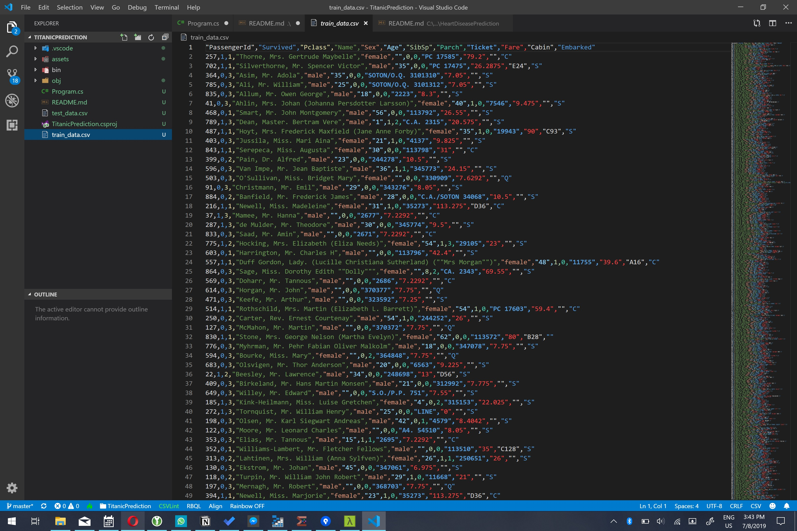

# Assignment: Predict who survived the Titanic disaster

The sinking of the RMS Titanic is one of the most infamous shipwrecks in history. On April 15, 1912, during her maiden voyage, the Titanic sank after colliding with an iceberg, killing 1502 out of 2224 passengers and crew. This sensational tragedy shocked the international community and led to better safety regulations for ships.


In this assignment you're going to build an app that can predict which Titanic passengers survived the disaster. You will use a decision tree classifier to make your predictions.

The first thing you will need for your app is the passenger manifest of the Titanic's last voyage. You will use the famous [Kaggle Titanic Dataset](https://github.com/sbaidachni/MLNETTitanic/tree/master/MLNetTitanic) which has data for a subset of 891 passengers.

Download the [test_data](https://github.com/mdfarragher/DSC/blob/master/BinaryClassification/TitanicPrediction/test_data.csv) and [train_data](https://github.com/mdfarragher/DSC/blob/master/BinaryClassification/TitanicPrediction/train_data.csv) files and save them to your project folder.

The training data file looks like this:



It’s a CSV file with 12 columns of information:

* The passenger identifier
* The label column containing ‘1’ if the passenger survived and ‘0’ if the passenger perished
* The class of travel (1–3)
* The name of the passenger
* The gender of the passenger (‘male’ or ‘female’)
* The age of the passenger, or ‘0’ if the age is unknown
* The number of siblings and/or spouses aboard
* The number of parents and/or children aboard
* The ticket number
* The fare paid
* The cabin number
* The port in which the passenger embarked

The second column is the label: 0 means the passenger perished, and 1 means the passenger survived. All other columns are input features from the passenger manifest.

You're gooing to build a binary classification model that reads in all columns and then predicts for each passenger if he or she survived.

Let's get started by creating a new folder for our application:

```bash
$ mkdir TitanicPrediction
$ cd TitanicPrediction
```

If you haven't done so yet, install the NimbusML package:

```bash
$ pip install nimbusml
```

And now launch the Visual Studio Code editor to start building your app:

```bash
$ code Program.py
```

Now you are ready to start coding. You’ll need a couple of import statements:

```python
import pandas as pd
import numpy as np
import math

from nimbusml import Pipeline, Role
from nimbusml.preprocessing.missing_values import Handler
from nimbusml.feature_extraction.categorical import OneHotVectorizer
from nimbusml.preprocessing.schema import TypeConverter, ColumnConcatenator
from nimbusml.ensemble import FastTreesBinaryClassifier

# the rest of the code goes here...
```

We'll use **Pandas** DataFrames to import data from CSV files and process it for training. We'll need **Numpy** too because Pandas depends on it, and we're going to use a function from the **math** library too.  

We'll also need the **Pipeline**, **Role**, **OneHotVectorizer**, **TypeConverter**, **ColumnConcatenator**, and **FastTreeBinaryClassifier** classes when we start building the machine learning pipeline. We'll do that in a couple of minutes.

And the **Handler** class is going to help us automatically replace all missing values in the dataset.

But first, let's load the training data in memory:

```python
# load the data files
trainData = pd.read_csv("train_data.csv", sep=',') 
testData = pd.read_csv("test_data.csv", sep=',') 

# the rest of the code goes here...
```

This code calls the **read_csv** function twice to load the training and testing datasets in memory.

Now we're going to set up the machine learning pipeline:

```python
# build a machine learning pipeline
pipeline = Pipeline([
    TypeConverter(columns = ["Pclass", "Age", "SibSp", "Parch", "Fare"], result_type = "R4"),
    Handler(replace_with = "Mean") << ["Age"],
    OneHotVectorizer() << ["Sex", "Ticket", "Cabin", "Embarked"],
    ColumnConcatenator() << {"Feature":["Pclass", "Age", "SibSp", "Parch", "Fare", "Sex", "Ticket", "Cabin", "Embarked"]},
    FastTreesBinaryClassifier() << {Role.Label:"Survived", Role.Feature:"Feature"}
])

# train the model
pipeline.fit(trainData)

# the rest of the code goes here...
```

Machine learning models in ML.NET are built with pipelines, which are sequences of data-loading, transformation, and learning components.

This pipeline has the following components:

* A **TypeConverter** that converts the data type of all input columns to **R4** which means a 32-bit floating point number or a single. We need this conversion because Pandas will load floating point data as R8 (64-bit floating point numbers or doubles), and ML.NET cannot deal with that datatype. 
* A **Handler** that replaces all missing **Age** values with the mean age computed over the entire training dataset.
* A **OneHotVectorizer** that performs one-hot encoding on all columns that contain enumerative string data: **Sex**, **Ticket**, **Cabin**, and **Embarked**. This is a required step because a machine learning model cannot be trained on enumerative data directly.
* A **ColumnConcatenator** which combines all input data columns into a single column called **Feature**. This is a required step because ML.NET can only train on a single input column.
* A final **FastTreesBinaryClassifier** learner which will analyze the **Feature** column to try and predict the **Survived** column.

Now all you need to do now is train the model on the entire dataset, compare the predictions with the labels, and compute a bunch of metrics that describe how accurate the model is:

```python
# evaluate the model and report metrics
metrics, _ = pipeline.test(testData)

print("\nEvaluation metrics:")
print("  Accuracy:          ", metrics["Accuracy"][0])
print("  Auc:               ", metrics["AUC"][0])
print("  Auprc:             ", metrics["AUPRC"][0])
print("  F1Score:           ", metrics["F1 Score"][0])
print("  LogLoss:           ", metrics["Log-loss"][0])
print("  LogLossReduction:  ", metrics["Log-loss reduction"][0])
print("  PositivePrecision: ", metrics["Positive precision"][0])
print("  PositiveRecall:    ", metrics["Positive recall"][0])
print("  NegativePrecision: ", metrics["Negative precision"][0])
print("  NegativeRecall:    ", metrics["Negative recall"][0])

# the rest of the code goes here...
```

This code calls the **test** pipeline function and provides the **testData** partition to generate predictions for every single passenger in the test partition and compare then to the actual survival data. 

The function will automatically calculate the following metrics:

* **Accuracy**: this is the number of correct predictions divided by the total number of predictions.
* **AreaUnderRocCurve**: a metric that indicates how accurate the model is: 0 = the model is wrong all the time, 0.5 = the model produces random output, 1 = the model is correct all the time. An AUC of 0.8 or higher is considered good.
* **AreaUnderPrecisionRecallCurve**: an alternate AUC metric that performs better for heavily imbalanced datasets with many more negative results than positive.
* **F1Score**: this is a metric that strikes a balance between Precision and Recall. It’s useful for imbalanced datasets with many more negative results than positive.
* **LogLoss**: this is a metric that expresses the size of the error in the predictions the model is making. A logloss of zero means every prediction is correct, and the loss value rises as the model makes more and more mistakes.
* **LogLossReduction**: this metric is also called the Reduction in Information Gain (RIG). It expresses the probability that the model’s predictions are better than random chance.
* **PositivePrecision**: also called ‘Precision’, this is the fraction of positive predictions that are correct. This is a good metric to use when the cost of a false positive prediction is high.
* **PositiveRecall**: also called ‘Recall’, this is the fraction of positive predictions out of all positive cases. This is a good metric to use when the cost of a false negative is high.
* **NegativePrecision**: this is the fraction of negative predictions that are correct.
* **NegativeRecall**: this is the fraction of negative predictions out of all negative cases.

To wrap up, let's have some fun and pretend that I’m going to take a trip on the Titanic too. I will embark in Southampton and pay $70 for a first-class cabin. I travel on my own without parents, children, or my spouse. 

What are my odds of surviving?

Add the following code:

```python
# set up a sample
sample = pd.DataFrame(  [[1.0, "male", 48, 0.0, 0.0, "B", 70.0, "123", "S"]],
                            columns = ["Pclass", "Sex", "Age", "SibSp", "Parch", "Ticket", "Fare", "Cabin", "Embarked"])

# predict diagnosis for sample
prediction = pipeline.predict(sample)

print("\nSingle prediction:")
print("  Prediction:  ", "Survived" if prediction["PredictedLabel"][0] == 1.0 else "Perished")
print("  Probability: ", prediction["Probability"][0])
```

This code sets up a new **DataFrame** with the details of my trip. Note that I have to provide the data and the column names separately. 

Next, we call the **predict** pipeline function to predict my survival. The resulting dataframe has three columns:

* A **PredictedLabel** column with the predicted survival: 1.0 if the passenger survived and 0.0 if the passenger perished.
* A **Score** column with the predicted score. This is the regression value produced by the binary classifier before thresholding. Note that we don't use this column in our code.
* A **Probability** column with the probability of the prediction. This can be interpreted as the level of confidence the machine learning algorithm has in its prediction.

So would I have survived the Titanic disaster?

Time to find out. Go to your terminal and run your code:

```bash
$ python ./Program.py
```

What results do you get? What is your accuracy, precision, recall, AUC, AUCPRC, and F1 value?

Is this dataset balanced? Which metrics should you use to evaluate your model? And what do the values say about the accuracy of your model? 

And what about me? Did I survive the disaster?

Do you think a decision tree is a good choice to predict Titanic survivors? Which other algorithms could you use instead? Do they give a better result?

Share your results in our group!
