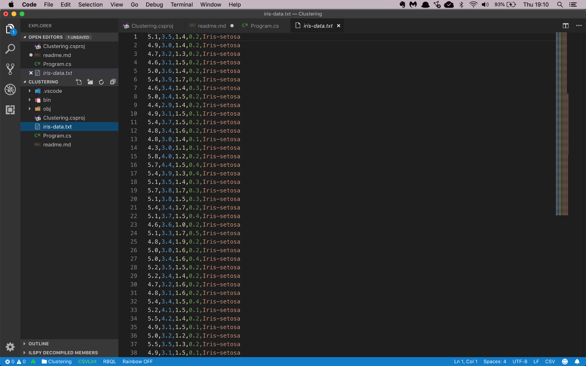

# Assignment: Cluster Iris flowers

In this assignment you are going to build an unsupervised learning app that clusters Iris flowers into discrete groups. 

There are three types of Iris flowers: Versicolor, Setosa, and Virginica. Each flower has two sets of leaves: the inner Petals and the outer Sepals.

Your goal is to build an app that can identify an Iris flower by its sepal and petal size.


Your challenge is that you're not going to use the dataset labels. Your app has to recognize patterns in the dataset and cluster the flowers into three groups without any help. 

Clustering is an example of **unsupervised learning** where the data science model has to figure out the labels on its own. 

The first thing you will need for your app is a data file with Iris flower petal and sepal sizes. You can use this [CSV file](https://github.com/mdfarragher/DSC/blob/master/Clustering/IrisFlower/iris-data.csv). Save it as **iris-data.csv** in your project folder.

The file looks like this:



It’s a CSV file with 5 columns:

* The length of the Sepal in centimeters
* The width of the Sepal in centimeters
* The length of the Petal in centimeters
* The width of the Petal in centimeters
* The type of Iris flower

You are going to build a clustering data science model that reads the data and then guesses the label for each flower in the dataset.

Of course the app won't know the real names of the flowers, so it's just going to number them: 1, 2, and 3.

Let's get started by creating a new folder for our application:

```bash
$ mkdir IrisFlowers
$ cd IrisFlowers
```

If you haven't done so yet, install the NimbusML package:

```bash
$ pip install nimbusml
```

And now launch the Visual Studio Code editor to start building your app:

```bash
$ code Program.py
```

Now you are ready to start coding. You’ll need a couple of import statements:

```python
import pandas as pd
import numpy as np

from sklearn.model_selection import train_test_split
from nimbusml import Pipeline, Role
from nimbusml.preprocessing.schema import TypeConverter
from nimbusml.preprocessing.schema import ColumnConcatenator
from nimbusml.cluster import KMeansPlusPlus

# the rest of the code goes here....
```

We'll use **Pandas** DataFrames to import data from CSV files and process it for training. We'll need **Numpy** too because Pandas depends on it. 

And we'll need the **Pipeline**, **Role**, **TypeConverter**, **ColumnConcatenator**, and **KMeansPlusPlus** classes when we start building the machine learning pipeline. We'll do that in a couple of minutes.

Finally, the **train_test_split** function in the **Sklearn** package is very convenient for splitting a single CSV file dataset into a training and testing partition.  

But first, let's load the training data in memory:

```python
# load the file
dataFrame = pd.read_csv("iris-data.csv", 
                        sep=',', 
                        header=None,
                        names = ["SepalLength", "SepalWidth", "PetalLength", "PetalWidth", "Label"])

# create train and test partitions
trainData, testData = train_test_split(dataFrame, test_size=0.2, random_state=42, shuffle=True)

# the rest of the code goes here....
```

This code calls **read_csv** from the Pandas package to load the CSV data into a new DataFrame. Note the **header=None** and the **names** argument that explicitly provides the column names. We have to do this because the data file does not contain any column headers.

Next we call **train_test_split** to set up a training partition with 80% of the data and a test partition with the remaining 20% of the data. Note the **shuffle=True** argument which produces randomized partitions. 

Now you’re ready to start building the machine learning model:

```python
# build a machine learning pipeline
pipeline = Pipeline([
    TypeConverter(columns = ["SepalLength", "SepalWidth", "PetalLength", "PetalWidth"], result_type = "R4"),
    ColumnConcatenator() << {"Feature":["SepalLength", "SepalWidth", "PetalLength", "PetalWidth"]},
    KMeansPlusPlus(n_clusters = 3, feature = ["Feature"])
])

# train the model
pipeline.fit(trainData)

# the rest of the code goes here...
```

Machine learning models in ML.NET are built with **Pipelines** which are sequences of data-loading, transformation, and learning components.

This pipeline has the following components:

* A **TypeConverter** that converts the four numeric fields to **R4** which means a 32-bit floating point number or a single. We need this conversion because Pandas will load floating point data as R8 (64-bit floating point numbers or doubles), and ML.NET cannot deal with that datatype. 
* A **ColumnConcatenator** which combines all input data columns into a single column called Feature. This is a required step because ML.NET can only train on a single input column.
* A final **KMeansPlusPlus** learner which will perform k-means clustering on the **Feature** column and group all flowers into 3 distinct **clusters**.

With the pipeline fully assembled, we can train the model on the training partition by calling the **fit** pipeline function and providing the **trainData** partition.

You now have a fully- trained model. So next, you'll have to grab the test data, predict the taxi fare for each trip, and calculate the accuracy of your model:

```python
# evaluate the model and report metrics
metrics, _ = pipeline.test(testData, "Label")
print("\nEvaluation metrics:")
print("  Normalized Mutual Information: ", metrics["NMI"][0])
print("  Average distance to centroid:  ", metrics["AvgMinScore"][0])

# the rest of the code goes here....
```

This code calls the **test** pipeline function and provides the **testData** partition and the **Label** column to generate cluster IDs for every single flower in the test partition and compare then to the actual flower labels. 

The function will automatically calculate the following metrics:

* **NMI**: this is the normalized mutual information or NMI value. It’s a number in the range from 0 to 1, with higher numbers indicating better clustering solutions.
* **AvgMinScore**: this is the average distance of each flower to its cluster centroid. It's expressed in centimeters with smaller numbers indicating better clustering solutions.

To wrap up, let’s use the model to make predictions.

You will pick 5 arbitrary flowers from the test set, run them through the model, and compare the predictions with the labels provided in the data file.

Here’s how to do it:

```python
# set up a sample
sample = testData.sample(n=5)

# create predictions for sample
prediction = pipeline.predict(sample)

# merge the sample and the predictions
sample.reset_index(drop=True, inplace=True)
prediction.reset_index(drop=True, inplace=True)
results = pd.concat([sample["Label"], prediction], axis=1)

# print results
pd.options.display.float_format = "{:,.4f}".format
print("\nSingle flower predictions:")
print(results)
```

This code calls the **sample** function to grab 5 random digits from the test set and store them in a new dataframe.

Next, we call the **predict** pipeline function to predict the cluster IDs for these flowers. The resulting dataframe has 4 columns:

* A **PredictedLabel** column with the ID of the cluster the flower is in. 
* Three **Score** columns with the distance in centimeters of the flower to each of the three cluster centroids. The closest centroid determines the cluster the flower is in.

So for every flower we get a cluster prediction and three centroid distances for each possible cluster. The column corresponding to the predicted cluster will have the lowest centroid distance. 

We're almost done, but we need to add the original label in here too so we can compare the prediction to the ground truth. The pandas **concat** function does just that: it merges the label column into the **prediction** dataframe. But for this to work, we need to remove the dataframe index first. That's what the preceding two calls to **reset_index** accomplish. 

So now we have a completed dataframe ready to print. Our final step is to use the **options.display.float_format field** to display all floating-point numbers in the dataframe in the same way. 

That's it, you're done!

Go to your terminal and run your code:

```bash
$ python ./Program.py
```

What results do you get? What is your average distance and your NMI value? 

What do you think this says about the quality of the clusters?

What did the 5 flower predictions look like? Does the cluster prediction match the label every time? 

Now change the code and check the predictions for every flower. How often does the model get it wrong? Which Iris types are the most confusing to the model?

Share your results in our group. 