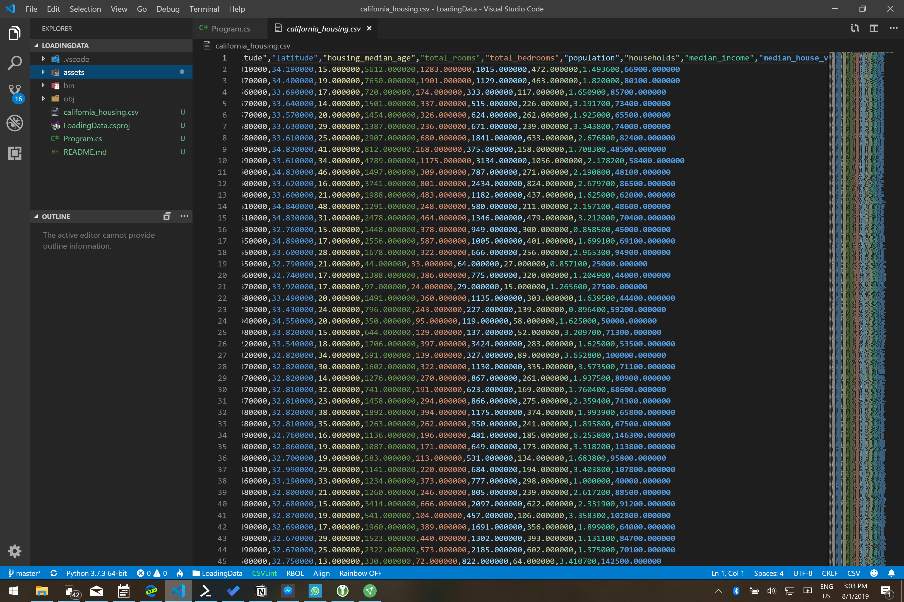

# Assignment: Load California housing data

In this assignment you're going to build an app that can load a dataset with the prices of houses in California. The data is not ready for training yet and needs a bit of processing. 

The first thing you'll need is a data file with house prices. The data from the 1990 California cencus has exactly what we need. 

Download the [California 1990 housing census](https://github.com/mdfarragher/DSC/blob/master/LoadingData/CaliforniaHousing/california_housing.csv) and save it as **california_housing.csv**. 

This is a CSV file with 17,000 records that looks like this:




The file contains information on 17k housing blocks all over the state of California:

* Column 1: The longitude of the housing block
* Column 2: The latitude of the housing block
* Column 3: The median age of all the houses in the block
* Column 4: The total number of rooms in all houses in the block
* Column 5: The total number of bedrooms in all houses in the block
* Column 6: The total number of people living in all houses in the block
* Column 7: The total number of households in all houses in the block
* Column 8: The median income of all people living in all houses in the block
* Column 9: The median house value for all houses in the block

We can use this data to train an app to predict the value of any house in and outside the state of California. 

Unfortunately we cannot train on this dataset directly. The data needs to be processed first to make it suitable for training. This is what you will do in this assignment. 

Let's get started. 

In these assignments you will not be using the code in Github. Instead, you'll be building all the applications 100% from scratch. So please make sure to create a new folder somewhere to hold all of your assignments.

Now please open a console window. You are going to create a new subfolder for this assignment:

```bash
$ mkdir LoadingData
$ cd LoadingData
```

Also make sure to copy the dataset file(s) into this folder because the code you're going to type next will expect them here.  

Now install the following packages

```bash
$ pip install nimbusml
$ pip install matplotlib
```

**NimbusML** is the Microsoft library that allows Python code to call the ML.NET machine learning engine. We will use it to build all our machine learning models in this course. And **MatPlotLib** is an advanced scientific plotting library.

Now you are ready to add code. Let's start with some import statements. 

Create a new Program.py file with Visual Studio Code and add the following code:

```python
import pandas as pd
import numpy as np
from matplotlib import pyplot as plt

# the rest of the code goes here
```

We'll use **Pandas** DataFrames to import data from CSV files and process it for training. We'll need **Numpy** too because Pandas depends on it. 

And we'll use **PyPlot** which is part of the MatPlotLib library to create all the plots in this assignment.

Now let's load the data file in memory:

```python
# load the file
dataFrame = pd.read_csv("california_housing.csv", 
                        sep=',', 
                        header=0)

# the rest of the code goes here...
```

This code calls **read_csv** from the Pandas package to load the CSV data into a new DataFrame. Note the **header=0** argument that tells the function to pull the column headers from the first line.

So now we have the data in memory. Let's plot the median house value as a function of median income and see what happens. 

Add the following code:

```python
# plot median house value by median income
plt.xlabel("median income")
plt.ylabel("median house value")
plt.scatter(dataFrame.median_income, dataFrame.median_house_value)
plt.show()

# the rest of the code goes here
```

The **plt.scatter** function sets up a scatterplot. We plot the **median_income** column on the x-axis and the **median_house_value** column on the y-axis. The **xlabel** and **ylabel** functions set up the axis labels and the **show** function displays the plot.

This is a good moment to save your work ;) 

We're now ready to run the app. Open a Powershell terminal and make sure you're in the project folder. Then type the following: 

```bash
$ python ./Program.py
```

Your app will run and open the chart in a new window. It should look like this:


As the median income level increases, the median house value also increases. There's still a big spread in the house values, but a vague 'cigar' shape is visible which suggests a linear relationship between these two variables.

But look at the horizontal line at 500,000. What's that all about? 

This is what **clipping** looks like. The creator of this dataset has clipped all housing blocks with a median house value above $500,000 back down to $500,000. We see this appear in the graph as a horizontal line that disrupts the linear 'cigar' shape. 

Let's start by using **data scrubbing** to get rid of these clipped records. Add the following code:

```python
# keep only records with median house values < 500,000
dataFrame = dataFrame[dataFrame.median_house_value < 500000]

# the rest of the code goes here...
```

This line of code will keep only those records with a median house value of 500,000 or less, and remove all other records from the dataset.  

Move your plotting code BELOW this code fragment and run your app again. 

Did this fix the problem? Is the clipping line gone?

Now let's take a closer look at the CSV file. Notice how all the columns are numbers in the range of 0..3000, but the median house value is in a range of 0..500,000. 

Remember when we talked about training data science models that we discussed having all data in a similar range?

So let's fix that now by using **data scaling**. We're going to divide the median house value by 1,000 to bring it down to a range more in line with the other data columns. 

Add the following code:

```python
# convert the house value range to thousands
dataFrame.median_house_value /= 1000

# the rest of the code goes here...
```

This line of code divides all values in the **median_house_value** column by 1,000 and overwrites the original values.

Let's see if the conversion worked. Add the following code at the bottom of the **main** function:

```python
# show the transformed data
print(dataFrame)

# the rest of the code goes here...
```

The **print** function will display all 9 columns and the first and last 5 records of the dataframe.

Now run your code. 

Find the median_house_value column in the output. Does it contain the correct value? Are you seeing house values divided by 1,000? 

Now let's fix the latitude and longitude. We're reading them in directly, but remember that we discussed how **Geo data should always be binned, one-hot encoded, and crossed?** 

Let's do that now. Add the following code:

```python
# bin and one-hot encode longitude
for r in zip(range(-124, -114), range(-123, -113)):
    dataFrame[f"longitude_{r}"] = dataFrame["longitude"].apply(
      lambda l: 1.0 if l >= r[0] and l < r[1] else 0.0)

# bin and one-hot encode latitude
for r in zip(range(32, 42), range(33, 43)):
    dataFrame[f"latitude_{r}"] = dataFrame["latitude"].apply(
      lambda l: 1.0 if l >= r[0] and l < r[1] else 0.0)

# the rest of the code goes here
```

This code uses a **for** loop to enumerate over a range of longitude and latitude bins. Each bin is exactly one degree wide. The **zip** function returns a list of tuples with the lower and upper bound of each bin. 

We then use the **apply** function to run each value in the longitude and latitude columns through a **lambda** expression which checks if the value is inside a specific bin. If so, the expression returns 1.0. If not, the expression returns 0.0.

We should now have 20 new columns in our dataframe: 10 columns for the longitude bins and 10 columns for the latitude bins. 

Let's test that assumption:

```python
# show the transformed data
print(dataFrame.info())
print(dataFrame)

# the rest of the code goes here...
```

The **info** function returns a list of all the columns in the dataframe. We should be able to see the 20 new columns with the binned longitude and latitude. 

Now run your app. 

What does the dataframe look like now? Is the total number of columns correct? And can you spot the new columns with the binned longitude and latitude values?

There's one more transformation remaining: we need to **cross** the longiture and latitude columns to generate a 100-element feature cross which represents a 10 by 10 grid that overlays the state of California.  

So let's do that now. Add the following code:

```python
# cross the longitude and latitude
for lo in zip(range(-124, -114), range(-123, -113)):
    for la in zip(range(32, 42), range(33, 43)):
        dataFrame[f"cross_{lo}x{la}"] = dataFrame[f"longitude_{lo}"] * dataFrame[f"latitude_{la}"]

# show the transformed data
print(dataFrame.info())
print(dataFrame)
```

We use two nested **for** loops to access every binned longitude and latitude column, and then simply multiply the two to generate a new crossed column. 

This will add another 100 extra columns to the dataframe, one for each unique grid cell in the feature cross.

Now run your app again. 

What do you see? Did it work? Is the total number of columns correct? And can you see the 100 new feature cross columns? And is there only a single '1' value in each row? 

Post your results in our group. 