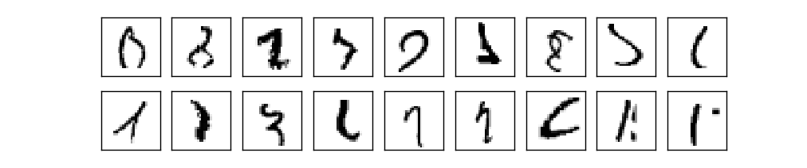
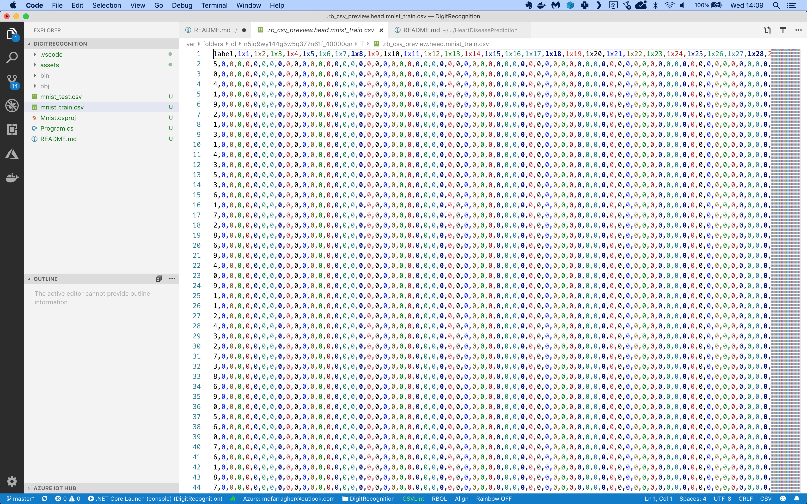

# Assignment: Recognize handwritten digits

In this article, You are going to build an app that recognizes handwritten digits from the famous MNIST machine learning dataset:


Your app must read these images of handwritten digits and correctly predict which digit is visible in each image.

This may seem like an easy challenge, but look at this:



These are a couple of digits from the dataset. Are you able to identify each one? It probably won’t surprise you to hear that the human error rate on this exercise is around 2.5%.

The first thing you will need for your app is a data file with images of handwritten digits. We will not use the original MNIST data because it's stored in a nonstandard binary format.

Instead, we'll use these excellent [CSV files](https://www.kaggle.com/oddrationale/mnist-in-csv/) prepared by Daniel Dato on Kaggle.

Create a Kaggle account if you don't have one yet, then download **mnist_train.csv** and **mnist_test.csv** and save them in your project folder.

There are 60,000 images in the training file and 10,000 in the test file. Each image is monochrome and resized to 28x28 pixels.

The training file looks like this:



It’s a CSV file with 785 columns:

* The first column contains the label. It tells us which one of the 10 possible digits is visible in the image.
* The next 784 columns are the pixel intensity values (0..255) for each pixel in the image, counting from left to right and top to bottom.

You are going to build a multiclass classification machine learning model that reads in all 785 columns, and then makes a prediction for each digit in the dataset.

Let's get started by creating a new folder for our application:

```bash
$ mkdir DigitRecognition
$ cd DigitRecognition
```

If you haven't done so yet, install the NimbusML package:

```bash
$ pip install nimbusml
```

And now launch the Visual Studio Code editor to start building your app:

```bash
$ code Program.py
```

Now you are ready to start coding. You’ll need a couple of import statements:

```python
import pandas as pd
import numpy as np

from nimbusml import Pipeline, Role
from nimbusml.preprocessing.schema import TypeConverter, ColumnConcatenator
from nimbusml.ensemble import LightGbmClassifier

# the rest of the code goes here...
```

We'll use **Pandas** DataFrames to import data from CSV files and process it for training. We'll need **Numpy** too because Pandas depends on it. 

And we'll need the **Pipeline**, **Role**, **TypeConverter**, **ColumnConcatenator**, and **LightGbmClassifier** classes when we start building the machine learning pipeline. We'll do that in a couple of minutes.

But first, let's load the training data in memory:

```python
# load the train and test files
trainData = pd.read_csv("mnist_train.csv", sep=',')
testData = pd.read_csv("mnist_test.csv", sep=',')

# the rest of the code goes here....
```

This code uses the **read_csv** function to load the CSV data directly into memory. We call this function twice to load the training and testing datasets separately.

Now let’s build the machine learning pipeline:

```python
# get a list of pixel column names
pixelColumns = trainData.columns[1:785].values.tolist()

# build a machine learning pipeline
pipeline = Pipeline([
    TypeConverter(columns=pixelColumns, result_type = "R4"),
    ColumnConcatenator() << {"Feature":pixelColumns},
    LightGbmClassifier() << {Role.Label:"label", Role.Feature:"Feature"}
])

# train the model
pipeline.fit(trainData)

# the rest of the code goes here....
```

The first thing we do before setting up the pipeline is to grab the names of all input columns and store them in the **pixelColumns** variable.

And then we're ready to build the pipeline. All machine learning models in ML.NET are built with pipelines which are sequences of data-loading, transformation, and learning components.

This pipeline has the following components:

* A **TypeConverter** that converts the data type of all input columns to **R4** which means a 32-bit floating point number or a single. We need this conversion because Pandas will load floating point data as R8 (64-bit floating point numbers or doubles), and ML.NET cannot deal with that datatype. 
* A **ColumnConcatenator** which combines all input columns into a single column called 'Feature'. This is a required step because ML.NET can only train on a single input column.
* A final **LightGbmClassifier** learner which will analyze the **Feature** column to try and predict the **label**.

With the pipeline fully assembled, we can train the model on the training partition by calling the **fit** pipeline function and providing the **trainData** dataset.

You now have a fully- trained model. So next, you'll have to grab the test data, predict the label for every handwritten digit, and calculate the accuracy of your model:

```python
# evaluate the model and report metrics
metrics, _ = pipeline.test(testData)

print("\nEvaluation metrics:")
print("  MicroAccuracy:    ", metrics["Accuracy(micro-avg)"][0])
print("  MacroAccuracy:    ", metrics["Accuracy(macro-avg)"][0])
print("  LogLoss:          ", metrics["Log-loss"][0])
print("  LogLossReduction: ", metrics["Log-loss reduction"][0])

# the rest of the code goes here....
```

This code calls the **test** pipeline function and provides the **testData** dataset to generate predictions for every single handwritten digit in the test set and compare them to the actual diagnoses. 

The function will automatically calculate the following metrics:

* **MicroAccuracy**: this is the average accuracy (=the number of correct predictions divided by the total number of predictions) for every digit in the dataset.
* **MacroAccuracy**: this is calculated by first calculating the average accuracy for each unique prediction value, and then taking the averages of those averages.
* **LogLoss**: this is a metric that expresses the size of the error in the predictions the model is making. A logloss of zero means every prediction is correct, and the loss value rises as the model makes more and more mistakes.
* **LogLossReduction**: this metric is also called the Reduction in Information Gain (RIG). It expresses the probability that the model’s predictions are better than random chance.

We can compare the micro- and macro accuracy to discover if the dataset is biased. In an unbiased set each unique label value will appear roughly the same number of times, and the micro- and macro accuracy values will be close together.

If the values are far apart, this suggests that there is some kind of bias in the data that we need to deal with. 

To wrap up, let’s use the model to make a prediction.

You will pick five arbitrary digits from the test set, run them through the model, and make a prediction for each one.

Here’s how to do it:

```python
# set up a sample
sample = testData.sample(n=5)

# predict diagnosis for sample
prediction = pipeline.predict(sample)

# merge the sample and the predictions
sample.reset_index(drop=True, inplace=True)
prediction.reset_index(drop=True, inplace=True)
results = pd.concat([sample["label"], prediction], axis=1)

# print results
pd.options.display.float_format = "{:,.4f}".format
print("\nSingle digit predictions:")
print(results)
```

This code calls the **sample** function to grab 5 random digits from the test set and store them in a new dataframe.

Next, we call the **predict** pipeline function to predict the diagnosis for this patient. The resulting dataframe has 11 columns:

* A **PredictedLabel** column with the predicted label: 1 if the handwritten digit resembles a 1, 2 if the handwritten digit resembles a 2, and so on.
* Ten **Score** columns with the probabilities that the handwritten digit matches any of the 10 possible label values.

So for every digit we get a final prediction and 10 probabilities for each possible digit value. The column corresponding to the final prediction will have the highest probability value. 

We're almost done, but we need to add the original label in here too so we can compare the prediction to the ground truth. The pandas **concat** function does just that: it merges the label column into the **prediction** dataframe. But for this to work, we need to remove the dataframe index first. That's what the preceding two calls to **reset_index** accomplish. 

So now we have a completed dataframe ready to print. Our final step is to use the **options.display.float_format field** to display all floating-point numbers in the dataframe in the same way. 

That's it, you're done!

Go to your terminal and run your code:

```bash
$ python ./Program.py
```

What results do you get? What are your micro- and macro accuracy values? Which logloss and logloss reduction did you get?

Do you think the dataset is biased? 

What can you say about the accuracy? Is this a good model? How far away are you from the human accuracy rate? Is this a superhuman or subhuman AI? 

What did the 5 digit predictions look like? Are there any incorrect predictions? Do you understand why the model got confused? 

Think about the code in this assignment. How could you improve the accuracy of the model even further?

Share your results in our group!
