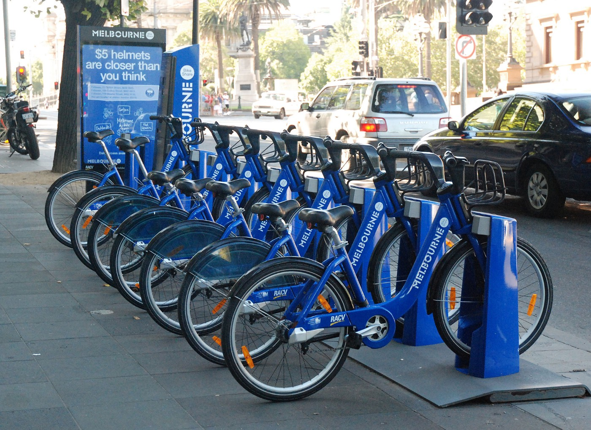

# Assignment: Predict bike sharing demand in Washington DC

In this assignment you're going to build an app that can predict bike sharing demand in Washington DC.

A bike-sharing system is a service in which bicycles are made available to individuals on a short term. Users borrow a bike from a dock and return it at another dock belonging to the same system. Docks are bike racks that lock the bike, and only release it by computer control.

You’ve probably seen docks around town, they look like this:



Bike sharing companies try to even out supply by manually distributing bikes across town, but they need to know how many bikes will be in demand at any given time in the city.

So let’s give them a hand with a machine learning model!

You are going to train a forest of regression decision trees on a dataset of bike sharing demand. Then you’ll use the fully-trained model to make a prediction for a given date and time.

The first thing you will need is a data file with lots of bike sharing demand numbers. We are going to use the [UCI Bike Sharing Dataset](http://archive.ics.uci.edu/ml/datasets/bike+sharing+dataset) from [Capital Bikeshare](https://www.capitalbikeshare.com/) in Metro DC. This dataset has 17,380 bike sharing records that span a 2-year period.

[Download the dataset](https://github.com/mdfarragher/DSC/blob/master/Regression/BikeDemandPrediction/bikedemand.csv) and save it in your project folder as **bikedmand.csv**.

The file looks like this:


It’s a comma-separated file with 17 columns:

* Instant: the record index
* Date: the date of the observation
* Season: the season (1 = springer, 2 = summer, 3 = fall, 4 = winter)
* Year: the year of the observation (0 = 2011, 1 = 2012)
* Month: the month of the observation ( 1 to 12)
* Hour: the hour of the observation (0 to 23)
* Holiday: if the date is a holiday or not
* Weekday: the day of the week of the observation
* WorkingDay: if the date is a working day
* Weather: the weather during the observation (1 = clear, 2 = mist, 3 = light snow/rain, 4 = heavy rain)
* Temperature : the normalized temperature in Celsius
* ATemperature: the normalized feeling temperature in Celsius
* Humidity: the normalized humidity
* Windspeed: the normalized wind speed
* Casual: the number of casual bike users at the time
* Registered: the number of registered bike users at the time
* Count: the total number of rental bikes in operation at the time

You can ignore the record index, the date, and the number of casual and registered bikes, and use everything else as input features. The final column **Count** is the label you're trying to predict.

Let's get started by creating a new folder for our application:

```bash
$ mkdir BikeDemandPrediction
$ cd BikeDemandPrediction
```

If you haven't done so yet, install the NimbusML package:

```bash
$ pip install nimbusml
```

And now launch the Visual Studio Code editor to start building your app:

```bash
$ code Program.py
```

Now you are ready to start coding. You’ll need a couple of import statements:

```python
import pandas as pd
import numpy as np

from sklearn.model_selection import train_test_split
from nimbusml import Pipeline, Role
from nimbusml.preprocessing.schema import TypeConverter
from nimbusml.preprocessing.schema import ColumnConcatenator
from nimbusml.ensemble import FastTreesRegressor

# the rest of the code goes here...
```

We'll use **Pandas** DataFrames to import data from CSV files and process it for training. We'll need **Numpy** too because Pandas depends on it. 

And we'll need the **Pipeline**, **Role**, **TypeConverter**, **ColumnConcatenator**, and **FastTreeRegressor** classes when we start building the machine learning pipeline. We'll do that in a couple of minutes.

Finally, the **train_test_split** function in the **Sklearn** package is very convenient for splitting a single CSV file dataset into a training and testing partition.  

But first, let's load the training data in memory:

```python
# load the file
dataFrame = pd.read_csv("bikedemand.csv", 
                        sep=',', 
                        header=0)

# create train and test partitions
trainData, testData = train_test_split(dataFrame, test_size=0.2, random_state=42, shuffle=True)

# the rest of the code goes here...
```

This code calls **read_csv** from the Pandas package to load the CSV data into a new DataFrame. Note the **header=0** argument that tells the function to pull the column headers from the first line.

Next we call **train_test_split** to set up a training partition with 80% of the data and a test partition with the remaining 20% of the data. Note the **shuffle=True** argument which produces randomized partitions. 

Now you’re ready to start building the machine learning model:

```python
# build a machine learning pipeline
pipeline = Pipeline([
    TypeConverter(columns = ["season","yr","mnth","hr","holiday","weekday","workingday","weathersit","temp","atemp","hum","windspeed"], result_type = "R4"),
    ColumnConcatenator() << {"Feature":["season","yr","mnth","hr","holiday","weekday","workingday","weathersit","temp","atemp","hum","windspeed"]},
    FastTreesRegressor() << {Role.Label:"cnt", Role.Feature:"Feature"}
])

# train the model
pipeline.fit(trainData)

# the rest of the code goes here...
```

Machine learning models in ML.NET are built with **Pipelines** which are sequences of data-loading, transformation, and learning components.

This pipeline has the following components:

* A **TypeConverter** that converts all numeric fields to **R4** which means a 32-bit floating point number or a single. We need this conversion because Pandas will load floating point data as R8 (64-bit floating point numbers or doubles), and ML.NET cannot deal with that datatype. 
* A **ColumnConcatenator** which combines all input data columns into a single column called Feature. This is a required step because ML.NET can only train on a single input column.
* A final **FastTreeRegressor** learner which will analyze the **Feature** column to try and predict the **cnt** (= the bike count on any given date and time).

With the pipeline fully assembled, we can train the model on the training partition by calling the **fit** pipeline function and providing the **trainData** partition.

You now have a fully- trained model. So next, you'll have to grab the test data, predict the number of bikes for each date and time, and calculate the accuracy of your model:

```python
# evaluate the model and report metrics
metrics, _ = pipeline.test(testData)
print("\nEvaluation metrics:")
print("  RMSE: ", metrics["RMS(avg)"][0])
print("  MSE: ", metrics["L2(avg)"][0])
print("  MAE: ", metrics["L1(avg)"][0])

# the rest of the code goes here...
```

This code calls the **test** pipeline function and provides the **testData** partition to generate predictions for every date and time in the test partition and compare then to the actual bike counts. 

The function will automatically calculate the following metrics:

* **RMS**: this is the root mean squared error or RMSE value. It’s the go-to metric in the field of machine learning to evaluate models and rate their accuracy. RMSE represents the length of a vector in n-dimensional space, made up of the error in each individual prediction.
* **L1**: this is the mean absolute prediction error or MAE value, expressed in dollars.
* **L2**: this is the mean squared error, or MSE value. Note that RMSE and MSE are related: RMSE is the square root of MSE.

To wrap up, let’s use the model to make a prediction.

I want to rent a bike in the fall of 2012, on a Thursday in August at 10am in the morning in clear weather. What will the bike demand be on that day?

Here’s how to make that prediction:

```python
# set up a sample
sample = pd.DataFrame(  [[3.0, 1.0, 8.0, 10.0, 0.0, 4.0, 1.0, 1.0, 0.8, 0.7576, 0.55, 0.2239]],
                            columns = ["season","yr","mnth","hr","holiday","weekday","workingday","weathersit","temp","atemp","hum","windspeed"])

# create prediction for sample
prediction = pipeline.predict(sample)
print("\nSingle trip prediction:")
print("  Number of bikes:", prediction["Score"][0])
```

This code sets up a new **DataFrame** with the details of my bike ride. Note that I have to provide the data and the column names separately. 

Next, we call the **predict** pipeline function to predict the number of bikes. The resulting dataframe has a **Score** column with the predicted count. 

What will the model prediction be?

Time to find out. Go to your terminal and run your code:

```bash
$ dotnet run
```

What results do you get? What are your RMSE and MAE values? Is this a good result? 

And what bike demand does your model predict on the day I wanted to take my bike ride? 

Now take a look at the hyperparameters. Try to change the behavior of the fast forest learner and see what happens to the accuracy of your model. Did your model improve or get worse? 

Share your results in our group!
