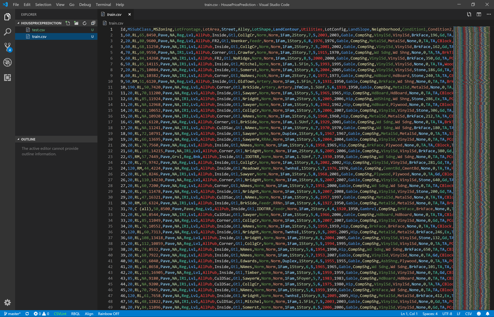

# The case

Ask a home buyer to describe their dream house, and they probably won't begin with the height of the basement ceiling or the proximity to an east-west railroad. But a detailed analysis of houses and sales prices actually proves that these metrics have a much greater influence on price negotiations than the number of bedrooms or a white-picket fence.

In this case study, you're going to answer the age-old question: what exactly determines the sales price of a house? 

And once you have your fully-trained app up and running, you can use it to predict the sales price of any house. Just plug in the relevant numbers and your app will generate a sales price prediction.

But how accurate will these predictions be? Can you actually use this app in a realtor business?

That's for you to find out! 

# The dataset



In this case study you'll be working with the Iowa House Price dataset. This data set describes the sale of individual residential property in Ames, Iowa from 2006 to 2010. 

The data set contains 1460 records and a large number of feature columns involved in assessing home values. You can use any combination of features you like to generate your house price predictions.

There is 1 file in the dataset:
* [data.csv](https://github.com/mdfarragher/DSC/blob/master/Regression/HousePricePrediction/data.csv) which contains 1460 records, 80 input features, and one output label. You will use this file to train and evaluate your model.

Download the file and save it in your project folder.

Here's a description of all 81 columns in the training file:
* SalePrice - the property's sale price in dollars. This is the target variable that you're trying to predict.
* MSSubClass: The building class
* MSZoning: The general zoning classification
* LotFrontage: Linear feet of street connected to property
* LotArea: Lot size in square feet
* Street: Type of road access
* Alley: Type of alley access
* LotShape: General shape of property
* LandContour: Flatness of the property
* Utilities: Type of utilities available
* LotConfig: Lot configuration
* LandSlope: Slope of property
* Neighborhood: Physical locations within Ames city limits
* Condition1: Proximity to main road or railroad
* Condition2: Proximity to main road or railroad (if a second is present)
* BldgType: Type of dwelling
* HouseStyle: Style of dwelling
* OverallQual: Overall material and finish quality
* OverallCond: Overall condition rating
* YearBuilt: Original construction date
* YearRemodAdd: Remodel date
* RoofStyle: Type of roof
* RoofMatl: Roof material
* Exterior1st: Exterior covering on house
* Exterior2nd: Exterior covering on house (if more than one material)
* MasVnrType: Masonry veneer type
* MasVnrArea: Masonry veneer area in square feet
* ExterQual: Exterior material quality
* ExterCond: Present condition of the material on the exterior
* Foundation: Type of foundation
* BsmtQual: Height of the basement
* BsmtCond: General condition of the basement
* BsmtExposure: Walkout or garden level basement walls
* BsmtFinType1: Quality of basement finished area
* BsmtFinSF1: Type 1 finished square feet
* BsmtFinType2: Quality of second finished area (if present)
* BsmtFinSF2: Type 2 finished square feet
* BsmtUnfSF: Unfinished square feet of basement area
* TotalBsmtSF: Total square feet of basement area
* Heating: Type of heating
* HeatingQC: Heating quality and condition
* CentralAir: Central air conditioning
* Electrical: Electrical system
* 1stFlrSF: First Floor square feet
* 2ndFlrSF: Second floor square feet
* LowQualFinSF: Low quality finished square feet (all floors)
* GrLivArea: Above grade (ground) living area square feet
* BsmtFullBath: Basement full bathrooms
* BsmtHalfBath: Basement half bathrooms
* FullBath: Full bathrooms above grade
* HalfBath: Half baths above grade
* Bedroom: Number of bedrooms above basement level
* Kitchen: Number of kitchens
* KitchenQual: Kitchen quality
* TotRmsAbvGrd: Total rooms above grade (does not include * bathrooms)
* Functional: Home functionality rating
* Fireplaces: Number of fireplaces
* FireplaceQu: Fireplace quality
* GarageType: Garage location
* GarageYrBlt: Year garage was built
* GarageFinish: Interior finish of the garage
* GarageCars: Size of garage in car capacity
* GarageArea: Size of garage in square feet
* GarageQual: Garage quality
* GarageCond: Garage condition
* PavedDrive: Paved driveway
* WoodDeckSF: Wood deck area in square feet
* OpenPorchSF: Open porch area in square feet
* EnclosedPorch: Enclosed porch area in square feet
* 3SsnPorch: Three season porch area in square feet
* ScreenPorch: Screen porch area in square feet
* PoolArea: Pool area in square feet
* PoolQC: Pool quality
* Fence: Fence quality
* MiscFeature: Miscellaneous feature not covered in other categories
* MiscVal: $Value of miscellaneous feature
* MoSold: Month Sold
* YrSold: Year Sold
* SaleType: Type of sale
* SaleCondition: Condition of sale

# Getting started
Go to the console and set up a new folder for your application:

```bash
$ mkdir HousePricePrediction 
$ cd HousePricePrediction
```

If you haven't done so yet, install the NimbusML package:

```bash
$ pip install nimbusml
```

And now launch the Visual Studio Code editor to start building your app:

```bash
$ code Program.py
```

The rest is up to you! 

# Your assignment
I want you to build an app that reads the data file, processes it, and then trains a linear regression model on the data.

You can select any combination of input features you like, and you can perform any kind of data processing you like on the columns. 

Partition the data and use the trained model to make house price predictions on all the houses in the test partition. Calculate the best possible **RMSE** and **MAE** and share it in our group. 

See if you can get the RMSE as low as possible. Share in our group how you did it. Which features did you select, how did you process them, and how did you configure your model? 

Good luck!