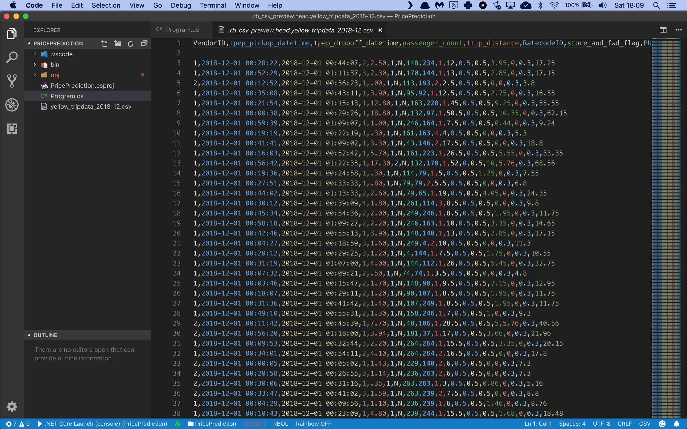

# Assignment: Predict taxi fares in New York

In this assignment you're going to build an app that can predict taxi fares in New York.

The first thing you'll need is a data file with transcripts of New York taxi rides. The [NYC Taxi & Limousine Commission](https://www1.nyc.gov/site/tlc/about/tlc-trip-record-data.page) provides yearly TLC Trip Record Data files which have exactly what you need.

Download the [Yellow Taxi Trip Records from December 2018](https://s3.amazonaws.com/nyc-tlc/trip+data/yellow_tripdata_2018-12.csv) and save it as **yellow_tripdata_2018-12.csv**. 

This is a CSV file with 8,173,233 records that looks like this:





There are a lot of columns with interesting information in this data file, but you will only train on the following:

* Column 0: The data provider vendor ID
* Column 3: Number of passengers
* Column 4: Trip distance
* Column 5: The rate code (standard, JFK, Newark, …)
* Column 9: Payment type (credit card, cash, …)
* Column 10: Fare amount

You are going to build a machine learning model in Python that will use columns 0, 3, 4, 5, and 9 as input, and use them to predict the taxi fare for every trip. Then you’ll compare the predicted fares with the actual taxi fares in column 10, and evaluate the accuracy of your model.

Let's get started by creating a new folder for our application:

```bash
$ mkdir TaxiFarePrediction
$ cd TaxiFarePrediction
```

If you haven't done so yet, install the NimbusML package:

```bash
$ pip install nimbusml
```

And now launch the Visual Studio Code editor to start building your app:

```bash
$ code Program.py
```

Now you are ready to start coding. You’ll need a couple of import statements:

```python
import pandas as pd
import numpy as np

from sklearn.model_selection import train_test_split
from nimbusml import Pipeline, Role
from nimbusml.preprocessing.schema import TypeConverter
from nimbusml.preprocessing.schema import ColumnConcatenator
from nimbusml.feature_extraction.categorical import OneHotVectorizer
from nimbusml.ensemble import FastTreesRegressor

# the rest of the code goes here...
```

We'll use **Pandas** DataFrames to import data from CSV files and process it for training. We'll need **Numpy** too because Pandas depends on it. 

And we'll need the **Pipeline**, **Role**, **TypeConverter**, **ColumnConcatenator**, **OneHotVectorizer**, and **FastTreeRegressor** classes when we start building the machine learning pipeline. We'll do that in a couple of minutes.

Finally, the **train_test_split** function in the **Sklearn** package is very convenient for splitting a single CSV file dataset into a training and testing partition.  

But first, let's load the training data in memory:

```python
# load the file
dataFrame = pd.read_csv("yellow_tripdata_2018-12.csv", 
                        sep=',', 
                        header=0)

# create train and test partitions
trainData, testData = train_test_split(dataFrame, test_size=0.2, random_state=42, shuffle=True)

# the rest of the code goes here...
```

This code calls **read_csv** from the Pandas package to load the CSV data into a new DataFrame. Note the **header=0** argument that tells the function to pull the column headers from the first line.

Next we call **train_test_split** to set up a training partition with 80% of the data and a test partition with the remaining 20% of the data. Note the **shuffle=True** argument which produces randomized partitions. 

Now you’re ready to start building the machine learning model:

```python
# build a machine learning pipeline
pipeline = Pipeline([
    TypeConverter(columns = ["passenger_count", "trip_distance"], result_type = "R4"),
    OneHotVectorizer() << ["VendorID", "RatecodeID", "payment_type"],
    ColumnConcatenator() << {"Feature":["VendorID", "RatecodeID", "payment_type", "passenger_count", "trip_distance"]},
    FastTreesRegressor() << {Role.Label:"total_amount", Role.Feature:"Feature"}
])

# train the model
pipeline.fit(trainData)

# the rest of the code goes here...
```

Machine learning models in ML.NET are built with **Pipelines** which are sequences of data-loading, transformation, and learning components.

This pipeline has the following components:

* A **TypeConverter** that converts the passenger_count and trip_distance columns to **R4** which means a 32-bit floating point number or a single. We need this conversion because Pandas will load floating point data as R8 (64-bit floating point numbers or doubles), and ML.NET cannot deal with that datatype. 
* An **OneHotVectorizer** that performs one-hot encoding on the three columns that contains enumerative data: **VendorID**, **RatecodeID**, and **payment_type**. This is a required step because we don't want the machine learning model to treat these columns as numeric values.
* A **ColumnConcatenator** which combines all input data columns into a single column called Feature. This is a required step because ML.NET can only train on a single input column.
* A final **FastTreeRegressor** learner which will analyze the **Feature** column to try and predict the **total_amount**.

Let's take another look at those VendorID, RatecodeID and payment_type columns. 

The RatecodeID column holds a numeric value but it's actually an enumeration with the following values:

* 1 = standard
* 2 = JFK
* 3 = Newark
* 4 = Nassau
* 5 = negotiated
* 6 = group

The paymnent_type is also numeric and defined as follows:

* 1 = Credit card
* 2 = Cash
* 3 = No charge
* 4 = Dispute
* 5 = Unknown
* 6 = Voided trip

And VendorID is a numeric code that identifies a taxi vendor. 

These numbers don’t have any special meaning. And we certainly don’t want the machine learning model to start believing that a trip to Newark is three times as important as a standard fare because the numeric value is three times larger.

And this is why we need one-hot encoding. This is a special trick to tell the machine learning model that **VendorID**, **RatecodeID** and **payment_type** are just enumerations and the underlying numeric values don’t have any special meaning.

With the pipeline fully assembled, we can train the model on the training partition by calling the **fit** pipeline function and providing the **trainData** partition.

You now have a fully- trained model. So next, you'll have to grab the test data, predict the taxi fare for each trip, and calculate the accuracy of your model:

```python
# evaluate the model and report metrics
metrics, _ = pipeline.test(testData)
print("\nEvaluation metrics:")
print("  RMSE: ", metrics["RMS(avg)"][0])
print("  MSE: ", metrics["L2(avg)"][0])
print("  MAE: ", metrics["L1(avg)"][0])

# the rest of the code goes here...
```

This code calls the **test** pipeline function and provides the **testData** partition to generate predictions for every single taxi trip in the test partition and compare then to the actual taxi fares. 

The function will automatically calculate the following metrics:

* **RMS**: this is the root mean squared error or RMSE value. It’s the go-to metric in the field of machine learning to evaluate models and rate their accuracy. RMSE represents the length of a vector in n-dimensional space, made up of the error in each individual prediction.
* **L1**: this is the mean absolute prediction error or MAE value, expressed in dollars.
* **L2**: this is the mean squared error, or MSE value. Note that RMSE and MSE are related: RMSE is the square root of MSE.

To wrap up, let’s use the model to make a prediction.

Imagine that I'm going to take a standard-rate taxi trip with vendor 1, I cover a distance of 3.75 miles, I am the only passenger, and I pay by credit card. What would my fare be? 

Here’s how to make that prediction:

```python
# set up a trip sample
tripSample = pd.DataFrame(  [[1, 1, 1, 1.0, 3.75]],
                            columns = ["VendorID", "RatecodeID", "payment_type", "passenger_count", "trip_distance"])

# predict fare for trip sample
prediction = pipeline.predict(tripSample)
print("\nSingle trip prediction:")
print("  Fare:", prediction["Score"][0])
```

This code sets up a new **DataFrame** with the details of my taxi trip. Note that I have to provide the data and the column names separately. 

Next, we call the **predict** pipeline function to predict the fare for this trip. The resulting dataframe has a **Score** column with the predicted taxi fare. 

So how much do you think my trip will cost? 

Let's find out. Go to your terminal and run your code:

```bash
$ python ./Program.py
```

What results do you get? What are your RMSE and MAE values? Is this a good result? 

And how much does your model predict I have to pay for my taxi ride? Is the prediction in the range of accetable values for this trip? 

Now make some changes to my trip. Change the vendor ID, or the distance, or the manner of payment. How does this affect the final fare prediction? And what do you think this means?  

Think about the code in this assignment. How could you improve the accuracy of the model? What's your best RMSE value? 

Share your results in our group!
